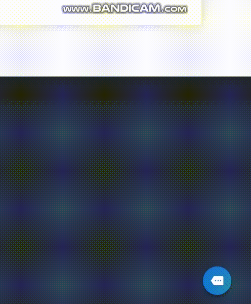

# ABDIE DEVELOPER


창의성과 신뢰를 최우선의 가치로 삼고 인성을 중시하는 abdie developer팀입니다 :)


## 목차

- 개발환경
- 사용법
- 개요
- 프로젝트 구조
- 화면 정의서


## 개발환경

- **Chrome Browser** 76.0.3809.100 (64bit)
- **Node.js** v10.16.0
- **npm** v6.10.3
- **Atom**


## 사용법

root(/)는 git repository 최상위 폴더를 의미합니다.

- development mode

  1. express 서버 실행 

     ```bash
     /vue_blog/backend > npm start
     ```

  2. vue-cli development 서버 실행

     ```bash
     /vue_blog > npm run serve
     ```

     

- production mode

  1. vue-cli 폴더 파일 build

     ```bash
     /vue_blog > npm run build
     ```

  2. express 서버 실행

     ```bash
     /vue_blog/backend > npm start
     ```

     

## 개요


**팀 단위로 주로 움직이는 개발자들을 위한 포트폴리오 사이트**입니다. 주 사용 프레임워크는 `Vue.js` 와 `Vuetify` 이며, 사이트의 모든 기능을 사용하기 위해서는 `Firebase`, `Gitlab/Github` 연동이 필요합니다. 


## 프로젝트 구조

프로젝트는 **Vue-cli 3.0** 과 **Express** 서버를 합쳐 통합개발환경을 만들었기 때문에, `vue-cli/` 내에 express 폴더인 `backend/`가 존재합니다. 


## 화면 정의서

프로젝트 웹 사이트의 주요 화면들을 보여줍니다.


### 사이트 메인화면


### 팀 소개 화면


### 포트폴리오 화면


### 포스트 화면


### 챗봇 화면




### 관리자 화면


### 게시물 및 댓글 등록 알람

